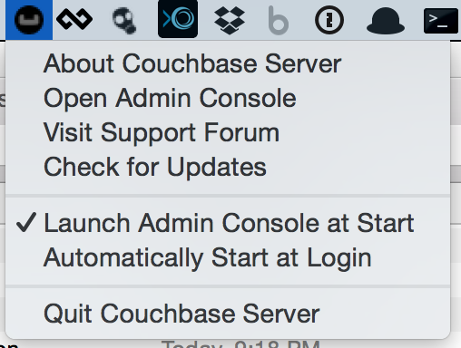

# Build Your First Couchbase Application Mac Installation Guide

## CommandBox Installation and Setup

If you have homebrew, run: 

`brew install http://downloads.ortussolutions.com/ortussolutions/commandbox/commandbox.rb`

If you don't have homebrew and want it, run the following: 

`ruby -e "$(curl -fsSL https://raw.githubusercontent.com/Homebrew/install/master/install)"`

Then run Step 1

If you want to setup CommandBox manually continue reading.

Unzip the appropriate CommandBox either `commandbox-mac-jre-2.1.0.zip` or `commandbox-mac-no-jre-2.1.0.zip` if you already have the JRE installed.

Open Terminal

Copy the box binary to your `/usr/bin` directory by running `cp ~/path/to/box /usr/bin`

Execute CommandBox by running `box`


## Couchbase Installation and Setup

### Install Couchbase

1. Unzip the install `couchbase-server-enterprise_3.1.0-macos_x86_64.zip`
2. Drag the Couchbase Server icon into your /Applications directory

### Open Couchbase

1. Go to your /Applications
2. Open "Couchbase Server"
3. Click the Menu Bar Icon 
4. Click "Open Admin Console"



### Setup


Click "Setup"

### Configure Server


- Keep default Databases Path
- Keep default Indices Path
- Keep default Hostname
- Choose "Start a new cluster"
- Set Per Server RAM Quota to ~<sup>1</sup>/<sub>4</sub> of System RAM
- Click "Next"

### Sample Buckets


- check "beer-sample"
- Click "Next"

### Default Bucket


- Choose "Couchbase" for the Bucket Type
- Set ~<sup>1</sup>/<sub>2</sub> of remaining memory for the default bucket
- Choose "Value Eviction" for Cache Metadata
- Check "Enable" for Replicas
- Choose "1" for the Number of Backups
- Choose "Low" for disk I/O priority
- Check "Enable" for Flush

### Notifications


- Fill Out Registration Information
- Click "Next"

### Secure Server


- Set the Username (highly suggest this is set to Administrator)
- Set an easy to remember a **password** (<- hint)

### Done


### Reset Password

If you need to reset the server password read this [http://docs.couchbase.com/admin/admin/CLI/cbreset_password_tool.html](http://docs.couchbase.com/admin/admin/CLI/cbreset_password_tool.html)

## Elastic Search Installation and Setup

If you have homebrew, run: 

`brew install elasticsearch`

Run

`elasticsearch --config=/usr/local/opt/elasticsearch/config/elasticsearch.yml`

Change to the elasticsearch directory

`cd /usr/local/opt/elasticsearch/`

Install the Couchbase Elastic Search plugin

```
bin/plugin -install transport-couchbase -url \
http://packages.couchbase.com.s3.amazonaws.com/releases/elastic-search-adapter/2.0.0/elasticsearch-transport-couchbase-2.0.0.zip
```

Set the username and password for the plugin

```
echo "couchbase.password: password" >> config/elasticsearch.yml ; echo "couchbase.username: Administrator" >> config/elasticsearch.yml```

Install the Elastic Search Head Plugin to provide a web interface 

`bin/plugin -install mobz/elasticsearch-head`

Start the elastic search server

`bin/elasticsearch`

Verify the install by opening up the web interface [http://localhost:9200/_plugin/head/](http://localhost:9200/_plugin/head/)

Create a new Index / Bucket in Elastic by clicking "Indicies"

Click "New Index"

Give the index a name i.e. "demo-site"

# Connect Couchbase to Elastic

##Couchbase Cluster Reference Setup

1. Go to the [XDCR](http://127.0.0.1:8091/index.html#sec=replications) tab
2. Click "Create Cluster Reference"
3. Enter a name for the cluster reference i.e. "ElasticSearch"
4. Enter "127.0.0.1:9091" for the IP/hostname
5. Enter the **value** for `couchbase.username` (i.e. Administrator) that provided earlier when setting up the plugin as the Username
6. Enter the **value** for `couchbase.password` (i.e. password) that provided earlier when setting up the plugin as the Password
7. Click "Save"

##Data Transfer Setup

1. From the [XDCR](http://127.0.0.1:8091/index.html#sec=replications) tab click "Create Replication"
2. Select the bucket from your setup i.e. "default"
3. Choose the cluster from the previous steps i.e. "ElasticSEarch"
4. Choose advanced and change the protocol to XDCR Protocol to "Version 1"


