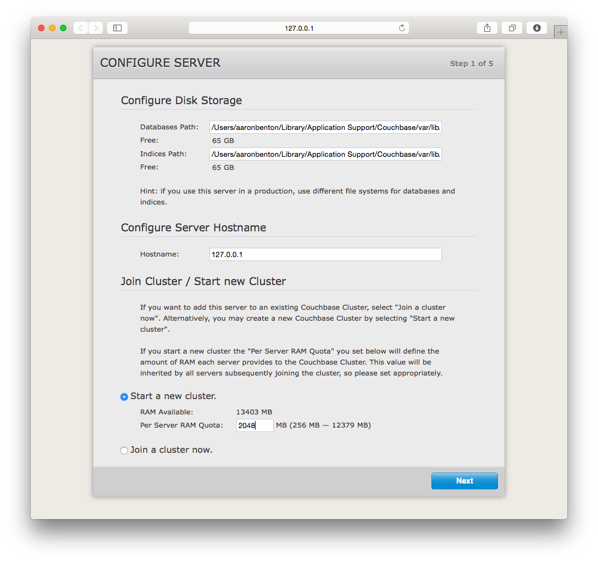

# Build Your First Couchbase Application Mac Installation Guide

## CommandBox Installation and Setup

If you have homebrew, run: 

`brew install http://downloads.ortussolutions.com/ortussolutions/commandbox/commandbox.rb`

If you don't have homebrew and want it, run the following: 

`ruby -e "$(curl -fsSL https://raw.githubusercontent.com/Homebrew/install/master/install)"`

Then run Step 1

If you want to setup CommandBox manually continue reading.

Unzip the appropriate CommandBox either `commandbox-mac-jre-2.1.0.zip` or `commandbox-mac-no-jre-2.1.0.zip` if you already have the JRE installed.

Open Terminal

Copy the box binary to your `/usr/bin` directory by running `cp ~/path/to/box /usr/bin`

Execute CommandBox by running `box`

## Couchbase Installation and Setup

### Install Couchbase

1. Unzip the install `couchbase-server-enterprise_3.1.0-macos_x86_64.zip`
2. Drag the Couchbase Server icon into your /Applications directory

### Open Couchbase

1. Go to your /Applications
2. Open "Couchbase Server"
3. Click the Menu Bar Icon 
4. Click "Open Admin Console"

### Setup

Click "Setup"

### Configure Server

- Keep default Databases Path
- Keep default Indices Path
- Keep default Hostname
- Choose "Start a new cluster"
- Set Per Server RAM Quota to ~1/4 of System RAM
- Click "Next"

### Sample Buckets

- check "beer-sample"
- Click "Next"

### Default Bucket

- Choose "Couchbase" for the Bucket Type
- Set ~1/2 of remaining memory for the default bucket
- Choose "Value Eviction" for Cache Metadata
- Check "Enable" for Replicas
- Choose "1" for the Number of Backups
- Choose "Low" for disk I/O priority
- Check "Enable" for Flush

### Notifications

- Fill Out Registration Information
- Click "Next"

### Secure Server

- Set the Username (highly suggest this is set to Administrator)
- Set an easy to remember a **password** (<- hint)

### Done

