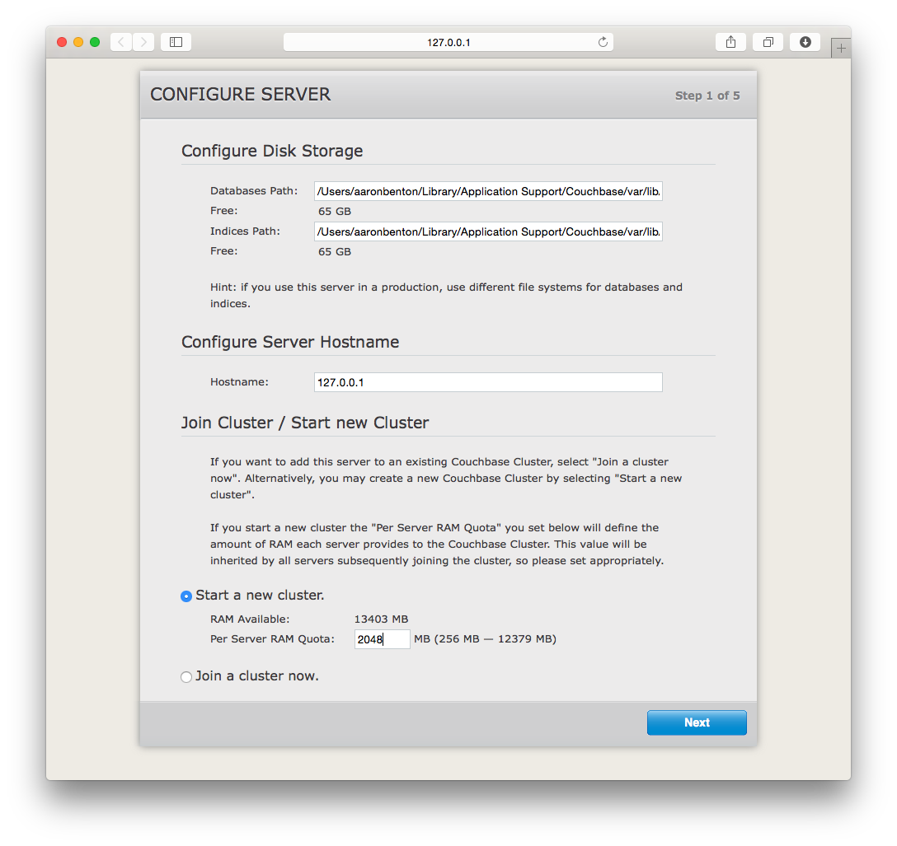

# Build Your First Couchbase Application Windows Installation Guide

## CommandBox Installation and Setup

Unzip the appropriate CommandBox either `commandbox-win64-jre-2.1.0.zip` or `commandbox-win64-no-jre-2.1.0.zip` if you already have the JRE installed.

Run CommandBox by executing the `box.exe`

## Couchbase Installation and Setup

### Install Couchbase

1. Run the `couchbase-server-enterprise_3.1.0-windows_amd64.exe` 
2. Click "Next"
3. Click "Next"
4. Click "Install"
5. Click "Finish"

### Open Couchbase

If the console is not already open, go to Start -> Program Files -> Couchbase -> Couchbase Console

### Setup

Click "Setup"

### Configure Server

- Keep default Databases Path
- Keep default Indices Path
- Keep default Hostname
- Choose "Start a new cluster"
- Set Per Server RAM Quota to ~1/4 of System RAM
- Click "Next"

### Sample Buckets

- check "beer-sample"
- Click "Next"

### Default Bucket

- Choose "Couchbase" for the Bucket Type
- Set ~1/2 of remaining memory for the default bucket
- Choose "Value Eviction" for Cache Metadata
- Check "Enable" for Replicas
- Choose "1" for the Number of Backups
- Choose "Low" for disk I/O priority
- Check "Enable" for Flush

### Notifications

- Fill Out Registration Information
- Click "Next"

### Secure Server

- Set the Username (highly suggest this is set to Administrator)
- Set an easy to remember a **password** (<- hint)

### Done

